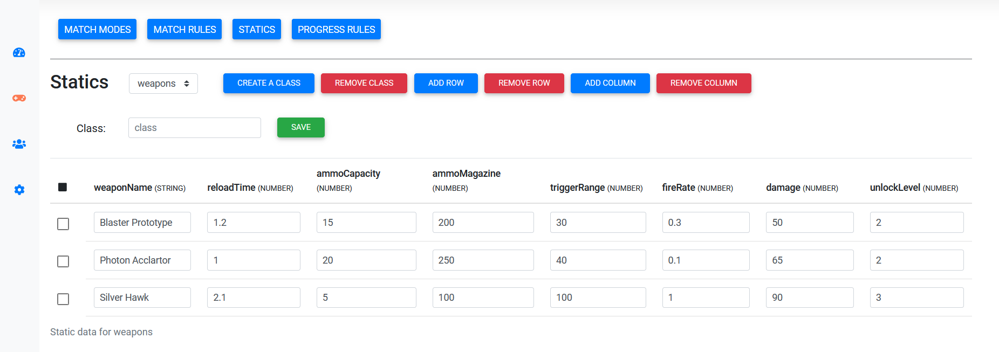

# Hicore Dashboard

Hicore Dashboard is a standalone dashboard for managing your Hicore Server. With the dashboard, you can control your game like user progress, match rules, create collection data for your game, analyze your game, network, users, etc. For more information check [Dashboard doc](https://hicore.dev/dashboard-install/)

## Getting Started

The fastest and easiest way to get started is to run server with Docker.

### Step 1: Clone Project

For deploying dashboard you should first clone the repository from Github for doing this in the terminal window enter the command:

```bash
 git clone https://github.com/hicore/hicore-dashboard
```

### Change Environment File

For changing environmen file go to the project folder and open `.env.production` file and change values.

```
VUE_APP_MOTHERSHIP_HOST=localhost
VUE_APP_MOTHERSHIP_PORT=7192
VUE_APP_DASHBOARD_PORT=7000
```

`VUE_APP_MOTHERSHIP_HOST` must be your server address.

### Step 3: Change Docker Compose File

For changing `docker-compose` file go to the project directory and open `docker-compose.yml` file and change the variable's as your needs.

```yaml
version: '3'

services:
  hicore-dashboard:
    build:
      context: .
      dockerfile: Dockerfile
    ports:
      - '7000:80'
    restart: always
```

#### Dashboard Config

| Key             | Description                              |
| --------------- | :--------------------------------------- |
| MOTHERSHIP_HOST | host name to connect mothership server   |
| MOTHERSHIP_PORT | port number to connect mothership server |
| DASHBOARD_PORT  | dashboard port number. default is `7000` |

### Step 4: Run Docker Compose

After changing variables, you can simply build Docker container by using this command:

```bash
 docker-compose up --build
```

In this stage Docker starts creating images and then the dashboard is ready to use and Hicore Dashboard runs on your machine.
you can connect to the dashboard at `localhost:7000`.



## Contributing

Pull requests are welcome. For major changes, please open an issue first to discuss what you would like to change.
